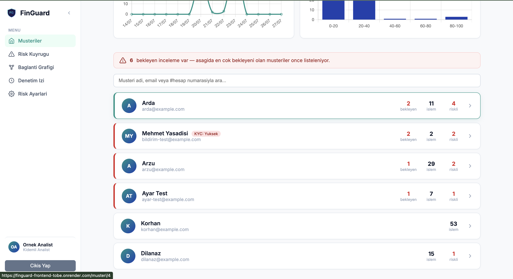
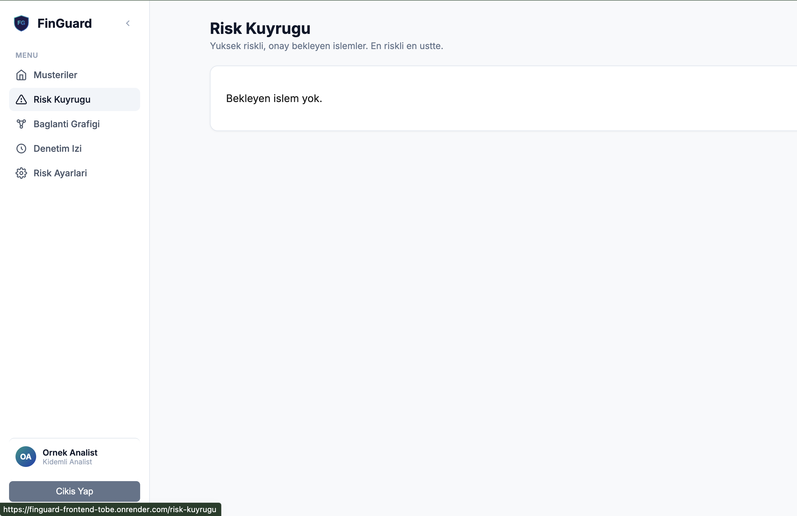
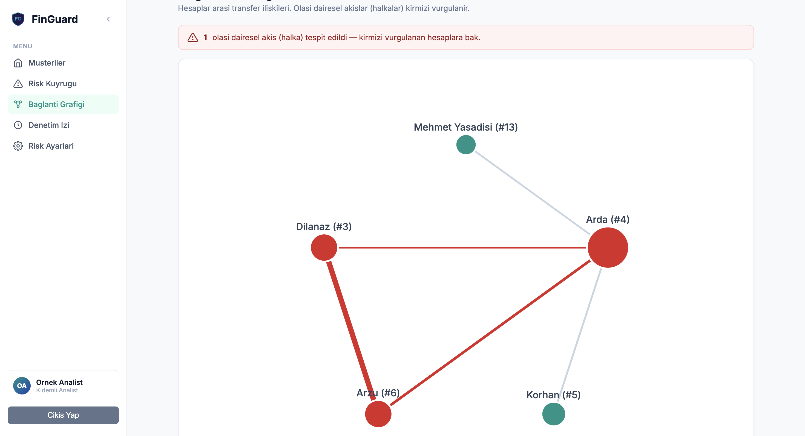
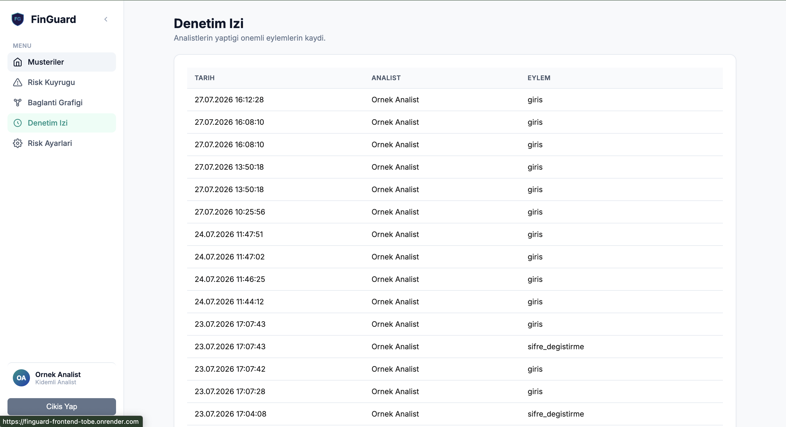
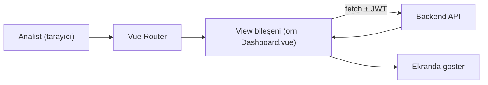

# FinGuard - Frontend

🔗 **Canlı Demo:** https://finguard-frontend-tobe.onrender.com
(Demo girişi: `analist@example.com` / `sifre123` — ücretsiz hosting olduğu için ilk açılış birkaç saniye sürebilir.)

FinGuard'ın analist arayüzü. Analistlerin giriş yapıp müşterileri, hesapları
ve işlemleri izlediği, riskli işlemleri incelediği panel. Backend/API ve risk
motoru için `finguard-backend` reposuna bakın.

## Ekran görüntüleri

| Dashboard | Risk Kuyruğu |
|---|---|
|  |  |

| Bağlantı Grafiği | Denetim İzi |
|---|---|
|  |  |

## Nasıl çalışır



Her sayfa (`src/views/*.vue`) `onMounted` sırasında `localStorage`'daki JWT
token'ı okuyup backend'e `fetch` ile istek atar, dönen veriyi kendi
`ref`/`computed`'larında tutar. Merkezi bir state yönetimi (Vuex/Pinia) yok -
her sayfa kendi verisini kendi yönetiyor.

## Ekranlar

- **Login / Şifremi Unuttum / Şifre Sıfırla** — sadece analistler giriş
  yapabilir, müşteriler sisteme giremez.
- **Dashboard** — tüm müşterilerin listesi, KPI paneli (toplam işlem,
  bugünkü işlem, riskli oran %, bekleyen inceleme sayısı), müşteri adı/email
  veya `#hesapNumarasi` ile global arama.
- **Müşteri Detayı** — o müşteriye ait tüm işlemler; her satırda Gönderen ve
  Alıcı (isim + maskelenmiş hesap numarası), risk skoru, filtreleme
  (risk/durum/hedef) ve arama (`#` ile hesap numarası, önek olmadan tutar),
  sıralama. Bir işlemin üzerine tıklayınca risk motorunun o skoru neden
  verdiğini gösteren açıklama listesi ve analistin durum/not girebileceği
  inceleme formu açılır.

### Klavye kısayolları (müşteri detay sayfasında)

- `↓` / `↑` — işlemler arasında gez
- `Enter` — açık işlemin inceleme durumunu/notunu kaydet
- Not yazarken `Cmd/Ctrl + Enter` — kaydet

## Kurulum

```bash
npm install
npm run dev
```

Backend'in (`finguard-backend`) `http://localhost:3000` adresinde ayrıca
çalışıyor olması gerekir.

### Production build

```bash
npm run build
```

Bu komut önce `vue-tsc --build` ile tip kontrolü yapar, sonra Vite ile
derler. `npm run dev` tip hatalarını göstermez, bu yüzden bir değişiklik
`npm run dev`'de sorunsuz görünse bile `npm run build`'de hataya neden
olabilir — build'i ayrıca çalıştırmak faydalıdır.

## Docker ile çalıştırma

Bu repo, `finguard-backend` içindeki `docker-compose.yml` tarafından
otomatik build edilir (backend ile aynı üst klasörde durması gerekir).
Detaylar için backend reposunun README'sine bakın.

`nginx.conf`, Vue Router'ın history modu için gerekli SPA fallback'i
(`try_files ... /index.html`) sağlar.

## CI

`.github/workflows/ci.yml`, her push/PR'da bağımlılıkları kurar, `npm run
build` ile tip kontrolü + derlemeyi doğrular ve Docker imajının başarıyla
build olduğunu kontrol eder.

## Bilinen sınırlamalar

- **Token saklama:** Giriş sonrası JWT (`localStorage.setItem('token', ...)`,
  bkz. `src/views/Login.vue`) tarayıcının `localStorage`'ında tutuluyor. Bu,
  sayfada XSS (kötü niyetli script çalıştırma) açığı olması durumunda token'ın
  çalınabileceği anlamına gelir — `httpOnly` cookie'ye göre daha zayıf bir
  yöntemdir. Bu demo projede bilinçli bir basitlik tercihi; production'a
  taşınacak bir sistemde token'ın backend tarafından `httpOnly` + `Secure`
  cookie olarak set edilmesi önerilir.
